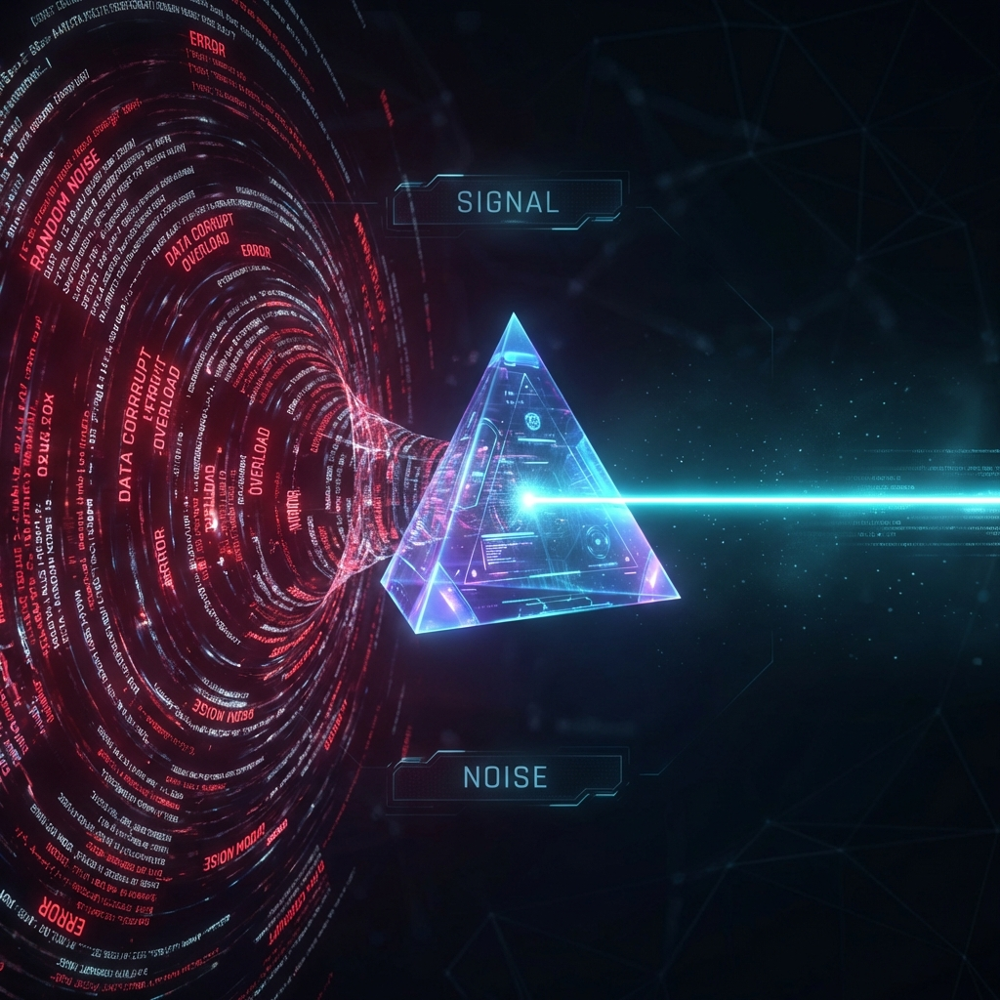

# LoFi Gate ⛩️✅

**Signal-first verification for AI coding agents.**



> AI agents don’t need more logs. They need less noise and more signal.

LoFi Gate turns chaotic test output into a deterministic interface that agents cannot bypass.

**AI agents fail not because they are bad at coding, but because they are forced to reason over chaos.**

Modern AI coding agents fail for predictable reasons:

- They drown in verbose logs and waste context.
- They learn to game tests instead of fixing bugs.
- They operate in environments designed for humans, not machines.

LoFi Gate changes the rules of the environment.

It creates a single, non-bypassable verification entry point that compresses output, enforces quality gates, and forces agents to interact with your project through signal, not noise.

If CI is your courtroom, LoFi Gate is your training dojo.

## Who is this for?

- You use AI coding agents (Claude, Cursor, Windsurf, etc.)
- Your test logs are huge, noisy, and token-expensive.
- You want to prevent agents from modifying tests to “cheat.”
- You care about deterministic, unskippable quality gates.

## 🚀 Core Features

### 1. Eliminating Context Bloat (The "Speed Lane")

LoFi Gate automatically detects and runs `npm run test:agent` (if configured) to execute tools like `jest --onlyChanged`.

- **Result**: The Agent just runs `npm test`, but gets the optimized "Speed Lane" automatically.

### 2. Smart Truncation

The script buffers output to prevent token overflow and context exhaustion.

- **Success**: Prints `✅ Verified` (hides 1000s of lines of logs).
- **Failure**: Prints only the last 100 lines of the error.

### 3. Parallel Execution & Auto-Retry

- **Parallelism**: Automatically runs Lint, Security, and Tests concurrently for instant feedback.
- **Flake Protection**: Automatically retries a failed test command once before reporting it to the agent, reducing friction from flaky tests.

## 🛡️ Advanced Gates ("The Iron Man Suite")

```text
      UNBOUNDED LOGS
 (errors, stack traces, noise)
            │
            ▼
    ╔════════════════╗
    ║   LoFi Gate    ║
    ║  Compression   ║
    ║    + Rules     ║
    ╚════════════════╝
            │
            ▼
    STRUCTURED SIGNAL
    {
      status: FAIL,
      cause: "test_login",
      location: "auth.spec.ts:42"
    }
```

---

AI agents were dropped into toolchains designed for humans.

Logs are verbose, signals are buried, and correctness is ambiguous.  
So agents learn to navigate chaos instead of solving problems.

LoFi Gate changes the environment.

It turns unbounded test output into a deterministic interface, forces every action through verification gates, and makes success or failure impossible to misinterpret.

CI judges results after the fact.  
LoFi Gate trains agents before they commit.

---

## Verification Loops, at Scale

Spotify’s background coding agents rely on verification loops and verifiers to control agent behavior at organizational scale.

LoFi Gate compresses the same idea to human scale: what happens when every developer has their own verification loop?

Spotify engineering deep dive:
https://engineering.atspotify.com/2025/12/feedback-loops-background-coding-agents-part-3

## ⚖️ The Judge Skill (Optional)

While `lofi_gate.py` checks the _Physics_ (Tests, Lint, Coverage), the **Judge Skill** checks the _Law_ (Intent, Anti-Cheating).

- **Role**: A self-reflexive agent skill that runs _after_ tests pass.
- **Checks**:
  - **Anti-Cheat**: "Did I modify existing tests?" (Forbidden).
  - **Intent**: "Did I actually fix the bug or just patch the symptom?"
- **Usage**: Copy `.agent/skills/lofi-gate-judge` to your agent's skill directory.

LoFi Gate **deterministically** enforces these project rules without agent intervention:

- **Gate 1: Security Scan**: If `package.json` exists, it runs `npm audit --audit-level=high`. Blocks on Critical/High vulnerabilities.
- **Gate 2: Strict TDD Enforcer**: Checks `git status` for new implementation files. Fails with "STRICT TDD VIOLATION" if code is created without a corresponding test file (implemented by diffing git status and mapping file patterns).
- **Gate 3: Coverage Check**: If a `coverage` script exists, it ensures thresholds are met before allowing a pass.

## Visual Proof: Signal vs. Noise

### ❌ The Old Way (Toxic Noise)

```text
$ npm test
> project@1.0.0 test
> jest

 PASS  test/auth.test.js (1.2s)
 PASS  test/utils.test.js (0.8s)
 PASS  test/api.test.js (2.1s)
 ... [500 lines of passing details] ...
Test Suites: 15 passed, 15 total
Tests:       84 passed, 84 total
Time:        4.5s
```

### ✅ The LoFi Gate Way (Pure Signal)

```text
$ python aiverify.py --parallel
🚀 Running 4 checks in PARALLEL...
----------------------------------------
✅ TDD Check Passed! (0.10s)
✅ Security Scan Passed! (1.20s)
✅ Lint Check Passed! (0.85s)
✅ Test Suite Passed! (2.10s)
----------------------------------------
✨ All systems go!
```

## ⚡ 30-Second Setup

1. **Copy the script**:

   ```bash
   cp lofi_gate.py scripts/
   ```

2. **Add the scripts** (one-liner):

   ```bash
   npm pkg set scripts.verify="python scripts/lofi_gate.py --parallel"
   ```

3. **Run it**:
   ```bash
   npm run verify
   ```

_Need help wiring it up? Point your agent to [instructions-for-ai.md](instructions-for-ai.md)._

## 🛑 How is this different from CI?

**LoFi Gate is not CI.**

- **CI (GitHub Actions)** is slow, verbose, and remote. It is for humans _after_ a failure.
- **LoFi Gate** is fast, compressed, and local. It is for Agents _before_ they commit.

Use LoFi Gate to keep your "Inner Loop" fast (<10s), and let CI be your final "Outer Loop" safety net.

If CI is your courtroom, LoFi Gate is your training dojo.

## ⚙️ Configuration

LoFi Gate respects your standard tool configurations (Jest, Vitest, Pytest, Cargo, etc).

_Running Python? Rust? Go? LoFi Gate automatically detects `pyproject.toml`, `Cargo.toml`, or `go.mod`._

**To set a Coverage Threshold (Jest example):**

```json
"jest": {
  "coverageThreshold": { "global": { "lines": 90 } }
}
```

**Standard Node Integration:**
Add to `package.json`:

```json
"scripts": {
  "test": "npm run verify",
  "verify": "python scripts/lofi_gate.py --parallel",
  "test:agent": "jest --onlyChanged",
  "lint": "eslint .",
  "coverage": "jest --coverage"
}
```

---

## The Full Suite Strategy

LoFi Gate is designed to be Part 1 of an **Inescapable Quality Harness** for AI Agents. To replicate our "Spotify-grade" results, we recommend this 4-Layer approach:

### Layer 0: Project Configuration ( The Foundation)

Before enforcing gates, you must map the territory for the Agent.
**Action**: Update your `package.json` to define the standard and the "Speed Lane".

```json
"scripts": {
  "verify": "python lofi_gate.py --parallel",  // The Main Gate
  "test": "npm run verify",                   // Redirect standard test
  "test:agent": "jest --onlyChanged"          // ⚡ THE SPEED LANE
}
```

- **Why `test:agent`?**: This is crucial. It tells the Agent: _"Only test what I changed."_ It prevents the agent from reading 500 irrelevant files, saving massive amounts of context and tokens.

### Layer 1: Local Gates (LoFi Gate)

- **Goal**: Enforcement.
- **Tool**: `lofi_gate.py` + Husky.
- **Setup**:
  1. Install Husky: `npm install husky --save-dev && npx husky init`
  2. Add Pre-Push Hook: `echo "npm run verify" > .husky/pre-push`
     _Result: The Agent cannot push "noisy" or broken code to the server._

**LoFi Gate cannot stop an agent from pushing code directly to GitHub.**
That is the role of branch protection rules.
LoFi Gate defines what “verified” means. GitHub enforces it.

### Layer 2: Repo Rules (The Hard Block)

- **Goal**: Prevent Bypassing.
- **Tool**: GitHub/GitLab Branch Protection.
- **Configuration**:
  - **Require Pull Request**: Ensure no direct pushes to `main`.
  - **Require Status Checks**: Force CI to pass before merging.
  - **Do Only**: prevent admins from bypassing rules.
    _Result: Even if the Agent tries to use `--no-verify`, the repo rejects the merge._

### Layer 3: Remote Verification (Standard CI)

- **Goal**: Post-Mortem Debugging.
- **Tool**: GitHub Actions / GitLab CI.
- **Configuration**: Run full standard tests (Jest/Pytest) with verbose logging.
- **Note**: Keep LoFi Gate **local**. Use the verbose CI logs only for deep debugging when things go wrong.

### 🌍 Beyond Node.js: Python & Rust

LoFi Gate isn't just for JavaScript. It's a universal adapter for AI-friendly verification.

- **Python**: Designed to integrate with `pytest` workflows.
- **Rust (Blazing Fast)**: Designed to wrap `cargo test` and `cargo check`.
  - _Benchmark_: Local verification with LoFi Gate took **<30 seconds**, compared to **5+ minutes** for equivalent cloud CI runs.

---

### A Note on "AI Instructions"

**We do NOT recommend adding specific instructions for LoFi Gate to your Agent's system prompt.**
Our research shows that Agents perform best when the environment _forces_ compliance naturally. By setting up Layer 1 (Husky) and Layer 2 (Repo Rules), the Agent encounters a "Physics of the Repo" that it must respect, without needing confusing meta-instructions.

---

_Built to help humans and AI agents work together in harmony._
