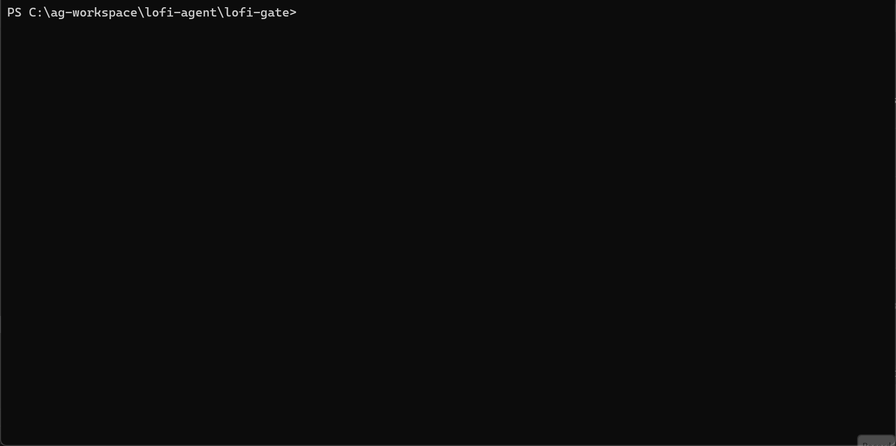

# LoFi Gate

**Signal-first verification for AI coding agents.**

## The Problem

AI Agents struggle to debug massive terminal output. Feeding an Agent 10,000 lines of CI logs ensures it misses the root cause and burns through your API budget.

### The Reality

A failed test run can easily produce 5,000-10,000 tokens of noise - stack traces, error messages, and framework output that obscures the actual problem.

Feeding this to an LLM ensures it misses the root cause and burns through your API budget. "Context Overflow" causes agents to hallucinate fixes or get stuck in failure loops.

### The Solution

LoFi Gate is a **signal-first** verification proxy. It wraps your existing tools (npm, cargo, pytest), truncates the noise, and delivers a concise, token-optimized failure report that Agents can actually understand.

> [!TIP]
> **Full Documentation**: [LoFi Gate Wiki](https://github.com/LoFi-Monk/lofi-gate/wiki)

## The Old Way


## The New Way



In extreme cases (complex failures, verbose frameworks), we've measured single test failures producing 15,000+ tokens.

## Quick Install

Get to a "working experience" in 30 seconds:

```bash
pip install lofi-gate
lofi-gate init
lofi-gate verify  # Test it immediately
```

_This creates `.agent/skills/lofi-gate/` with your local config._

## Usage

Run the gate to verify your changes. This will run your tests, lint, and security checks, and output a clean, token-optimized report.

```bash
lofi-gate verify
```

## Wire It Up

LoFi Gate is designed to be the "Hardware Interface" between your AI Agent and your project.

### 1. Choose Your Stack

Detailed setup guides for specific environments:

- [**Node.js**](https://github.com/LoFi-Monk/lofi-gate/wiki/Setup-Node) (`package.json`)
- [**Python**](https://github.com/LoFi-Monk/lofi-gate/wiki/Setup-Python) (`pyproject.toml`)
- [**Rust**](https://github.com/LoFi-Monk/lofi-gate/wiki/Setup-Rust) (`Cargo.toml`)
- [**Go**](https://github.com/LoFi-Monk/lofi-gate/wiki/Setup-Go) (`go.mod`)

### 2. Configure Your Agent

LoFi Gate works out of the box, but you can customize it:

- [**Configuration**](https://github.com/LoFi-Monk/lofi-gate/wiki/Configuration) (`lofi.toml`) - Toggle security checks, custom test commands, and more.

### 3. Optional: Enforce The Rules

Optional, but recommended:

- [**Skill: The Checkpoint**](https://github.com/LoFi-Monk/lofi-gate/wiki/Skill-Checkpoint) (Optional) - Helps prevent Agents from "faking" passing tests.
- [**GitHub Repo Rules**](https://github.com/LoFi-Monk/lofi-gate/wiki/GitHub-Rules) (Branch Protection)

### 4. Read The Docs

- [**Compatibility**](https://github.com/LoFi-Monk/lofi-gate/wiki/compatibility): Using LoFi Gate with Local Models.

* [**Logging & The Ledger**](https://github.com/LoFi-Monk/lofi-gate/wiki/Ledger): Understanding the `verification_history.md` format and Token Savings.

---

## The Ledger

Every time LoFi Gate runs, it calculates **Token Savings**.
Check `verification_history.md` to see exactly how much context (and money) you are saving per run.

> 📊 **Total Token Size:** 14502 | 💰 **Total Token Savings:** 12400

_Note: Token counts are holistic estimates based on typical 4-char/token heuristics._

I wanted to see how much "noise" I was sending to my LLM, for every test. I thought this was a helpful estimate to go by.
